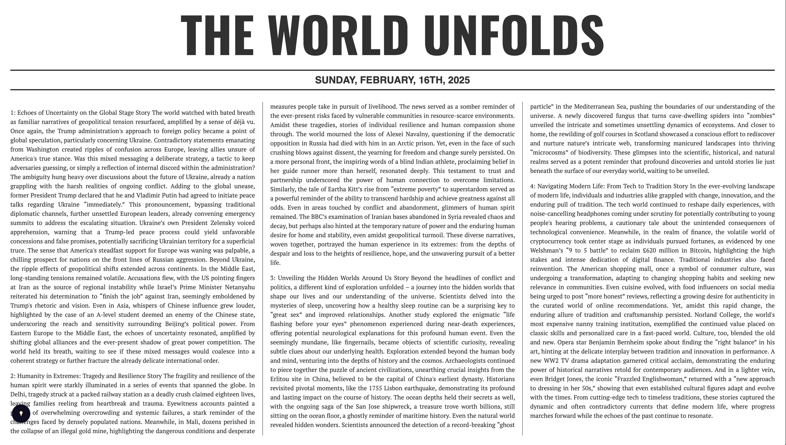

# **📰 NewsFeed Scraper & Summarizer**

## **Overview**
This project is a Python-based web scraper that extracts news headlines from **BBC** and **CNN**, summarizes them using OpenAI's API, and generates a formatted HTML page displaying the summarized stories.

## **Features**
- Scrapes news content from **CNN** and **BBC**.
- Uses **OpenAI API (via OpenRouter)** for **text summarization**.
- Generates an **HTML file** with formatted news stories.
- Retrieves **dynamic class names** for articles using BeautifulSoup.
- Supports **parsing and splitting** AI-generated summaries into multiple stories.
- Allows users to manually select the language for translating summarized news using **Google Translate API**.

## **Installation**
### **1. Clone the Repository**
```sh
git clone https://github.com/AntoniosKalattas/news-feed.git
cd news-feed
```

### **2. Install Dependencies**
Ensure you have **Python 3.11+** installed. Then, install required packages:
```sh
pip install -r requirements.txt
```

If you encounter a `ModuleNotFoundError`, install missing dependencies manually:
```sh
pip install beautifulsoup4 requests openai
```

### **3. Set Up APIs**
The script uses **OpenRouter API** for paraphrasing and summarization as well as **Google Translate API** for translation. Set up your API keys and credentials:

1. Create an account on [OpenRouter](https://openrouter.ai).
2. Create an account on [Google Cloud](https://cloud.google.com) and enable the Google Translate API.
3. Create a `config.json` file in the root directory of the project with the following content:
    ```json
    {
        "openAI_api_key": "your_openai_api_key_here",
        "google_credentials_path": "path_to_your_google_credentials.json"
    }
    ```
4. Replace `"your_openai_api_key_here"` with your actual OpenAI API key.
5. Replace `"path_to_your_google_credentials.json"` with the path to your Google Cloud credentials JSON file.(IAM -> Service Accounts -> Create Service. After goto your newly created service and download .json file under Key tab).

## **Usage**
### **Select Language (Default: English)**
To change the language for translation, modify the `target_language` variable in the `generateHTML` function call in the `main.py` file.

1. Open the `main.py` file.
2. Locate the `generateHTML` function call (around line 144).
3. Change the `target_language` parameter to your desired language code.

Examples of language codes include:
- `en` for English
- `es` for Spanish
- `el` for Greek
- `fr` for French
- `de` for German
- `it` for Italian
- `ja` for Japanese
- `ko` for Korean
- `pt` for Portuguese
- `ru` for Russian
- `zh` for Chinese

Example (for Spanish):
```python
generateHTML(stories, target_language='es')
```

### **Run the Script**
```sh
python3 main.py
```
This will:
- Scrape **CNN** and **BBC** for headlines.
- Use **OpenAI** to generate a **summary title**.
- Extract **4 summarized stories** from the news content.
- **Translate summarized content** into language selected.
- Generate an **HTML file** (`web/main.html`) containing the summarized news.

### **Expected Output**
- **Terminal Output**: A summary title.
- **Generated HTML File**: `web/main.html` displaying the summarized news.

## **Project Structure**
```
📂 News-feed
 ├── main.py              # Main script
 ├── requirements.txt     # Dependencies list
 ├── config.json          # Configuration file for API keys and credentials
 ├── web/
 │   ├── main.html        # Generated HTML file
 │   ├── style.css        # CSS for styling
 │   ├── script.js        # JS for additional functionality
 ├── img/
 │   ├── img.png          # Design preview image
 ├── README.md            # Documentation
```

## **Functions Overview**
| Function | Description |
|----------|------------|
| `askChat(question, content)` | Sends a request to OpenAI for summarization. |
| `extract_content(url, class_name, tag, get_link)` | Extracts text or links from the given webpage. |
| `get_class(url, element, sub_element=0)` | Retrieves the class name of an HTML element. |
| `get_formatted_date()` | Returns the formatted date in `Day, Month, DD, YYYY` format. |
| `getStories(data)` | Splits AI-generated output into multiple stories. |
| `translate_text(text, target_language)` | TTranslates summarized content. |
| `generateHTML(stories)` | Generates an HTML file with summarized news content. |


## **Dependencies**
- `beautifulsoup4`
- `requests`
- `openai`
- `datetime`
- `os`
- `sys`

## **Notes**
- Ensure your API key and credentials are **valid** and **active**.
- If the scraping fails, check the **class names** of elements on **CNN/BBC** (they may change over time).
- The script **overwrites** `web/main.html` each time it's executed.

## **Future Improvements**
- Add support for **more news sources**.
- Implement **error handling** for missing elements.
- Improve **formatting** and UI of the generated HTML.

---

# UI



https://codepen.io/saiphanindra1010/pen/wvKMrqL
